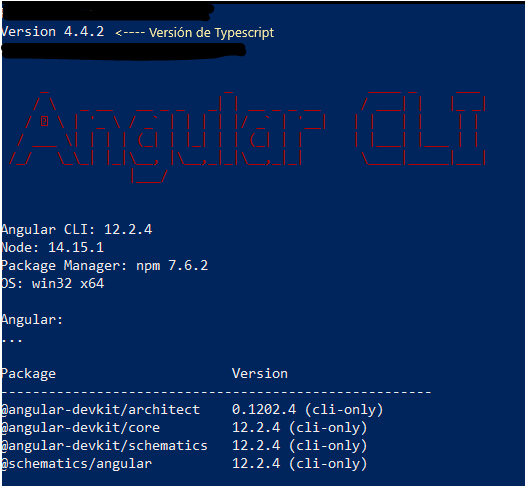

#  FRONTEND ANGULAR APLICACION AMBIENTE DE PRUEBAS
===================================================

Compilar desde atom el proyecto con ng serve -o  (Angular) y springboot desde el IDE de Spring Tool Suite con run as Spring Boot App (ALT+SHIFT+X ,B).

Esta es la version que uso de Angular y Typescript:

